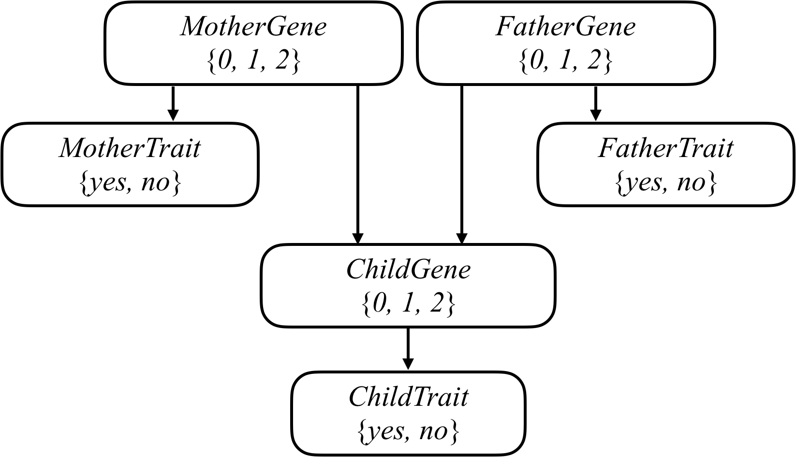

### An AI to assess the likelihood that a person will have a particular genetic trait.

# Introduction 

Mutated versions of the GJB2 gene are one of the leading causes of hearing impairment in newborns. Each person carries two versions of the gene, so each person has the potential to possess either 0, 1, or 2 copies of the hearing impairment version GJB2. Unless a person undergoes genetic testing, though, it’s not so easy to know how many copies of mutated GJB2 a person has. This is some “hidden state”: information that has an effect that we can observe (hearing impairment), but that we don’t necessarily directly know. After all, some people might have 1 or 2 copies of mutated GJB2 but not exhibit hearing impairment, while others might have no copies of mutated GJB2 yet still exhibit hearing impairment.

Every child inherits one copy of the GJB2 gene from each of their parents. If a parent has two copies of the mutated gene, then they will pass the mutated gene on to the child; if a parent has no copies of the mutated gene, then they will not pass the mutated gene on to the child; and if a parent has one copy of the mutated gene, then the gene is passed on to the child with probability 0.5. After a gene is passed on, though, it has some probability of undergoing additional mutation: changing from a version of the gene that causes hearing impairment to a version that doesn’t, or vice versa.

We can attempt to model all of these relationships by forming a Bayesian Network of all the relevant variables, as in the one below, which considers a family of two parents and a single child.


# Code
```
$ python heredity.py data/family0.csv
Harry:
  Gene:
    2: 0.0092
    1: 0.4557
    0: 0.5351
  Trait:
    True: 0.2665
    False: 0.7335
James:
  Gene:
    2: 0.1976
    1: 0.5106
    0: 0.2918
  Trait:
    True: 1.0000
    False: 0.0000
Lily:
  Gene:
    2: 0.0036
    1: 0.0136
    0: 0.9827
  Trait:
    True: 0.0000
    False: 1.0000
```

### Understanding 

Take a look at one of the sample data sets in the `data` directory by opening up `data/family0.csv` (you can open it up in a text editor, or in a spreadsheet application like Google Sheets, Excel, or Apple Numbers). Notice that the first row defines the columns for this CSV file: `name`, `mother`, `father`, and `trait`. The next row indicates that Harry has Lily as a mother, James as a father, and the empty cell for `trait` means we don’t know whether Harry has the trait or not. James, meanwhile, has no parents listed in the our data set (as indicated by the empty cells for `mother` and `father`), and does exhibit the trait (as indicated by the 1 in the trait cell). Lily, on the other hand, also has no parents listed in the data set, but does not exhibit the trait (as indicated by the `0` in the `trait` cell).

Open up `heredity.py` and take a look first at the definition of `PROBS`. `PROBS` is a dictionary containing a number of constants representing probabilities of various different events. All of these events have to do with how many copies of a particular gene a person has (hereafter referred to as simply “the gene”), and whether a person exhibits a particular trait (hereafter referred to as “the trait”) based on that gene. The data here is loosely based on the probabilities for the hearing impairment version of the GJB2 gene and the hearing impairment trait, but by changing these values, you could use your AI to draw inferences about other genes and traits as well!

First, `PROBS["gene"]` represents the unconditional probability distribution over the gene (i.e., the probability if we know nothing about that person’s parents). Based on the data in the distribution code, it would seem that in the population, there’s a 1% chance of having 2 copies of the gene, a 3% chance of having 1 copy of the gene, and a 96% chance of having 0 copies of the gene.

Next, `PROBS["trait"]` represents the conditional probability that a person exhibits a trait (like hearing impairment). This is actually three different probability distributions: one for each possible value for `gene`. So `PROBS["trait"][2]` is the probability distribution that a person has the trait given that they have two versions of the gene: in this case, they have a 65% chance of exhibiting the trait, and a 35% chance of not exhibiting the trait. Meanwhile, if a person has 0 copies of the gene, they have a 1% chance of exhibiting the trait, and a 99% chance of not exhibiting the trait.

Finally, `PROBS["mutation"]` is the probability that a gene mutates from being the gene in question to not being that gene, and vice versa. If a mother has two versions of the gene, for example, and therefore passes one on to her child, there’s a 1% chance it mutates into not being the target gene anymore. Conversely, if a mother has no versions of the gene, and therefore does not pass it onto her child, there’s a 1% chance it mutates into being the target gene. It’s therefore possible that even if neither parent has any copies of the gene in question, their child might have 1 or even 2 copies of the gene.

Ultimately, the probabilities you calculate will be based on these values in PROBS.

Now, take a look at the `main` function. The function first loads data from a file into a dictionary `people`. `people` maps each person’s name to another dictionary containing information about them: including their name, their mother (if one is listed in the data set), their father (if one is listed in the data set), and whether they are observed to have the trait in question (`True` if they do, `False` if they don’t, and `None` if we don’t know).

Next, `main` defines a dictionary of `probabilities`, with all probabilities initially set to 0. This is ultimately what your project will compute: for each person, your AI will calculate the probability distribution over how many of copies of the gene they have, as well as whether they have the trait or not. `probabilities["Harry"]["gene"][1]`, for example, will be the probability that Harry has 1 copy of the gene, and `probabilities["Lily"]["trait"][False]` will be the probability that Lily does not exhibit the trait.

If unfamiliar, this `probabilities` dictionary is created using a Python dictionary comprehension, which in this case creates one key/value pair for each `person` in our dictionary of `people`.

Ultimately, we’re looking to calculate these probabilities based on some evidence: given that we know certain people do or do not exhibit the trait, we’d like to determine these probabilities. Recall from lecture that we can calculate a conditional probability by summing up all of the joint probabilities that satisfy the evidence, and then normalize those probabilities so that they each sum to 1. Your task in this project is to implement three functions to do just that: `joint_probability` to compute a joint probability, `update` to add the newly computed joint probability to the existing probability distribution, and then `normalize` to ensure all probability distributions sum to 1 at the end.
